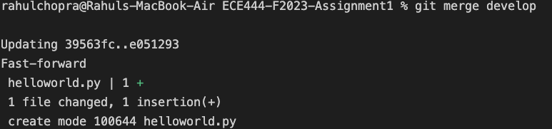
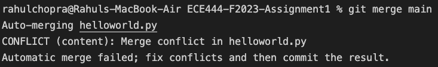
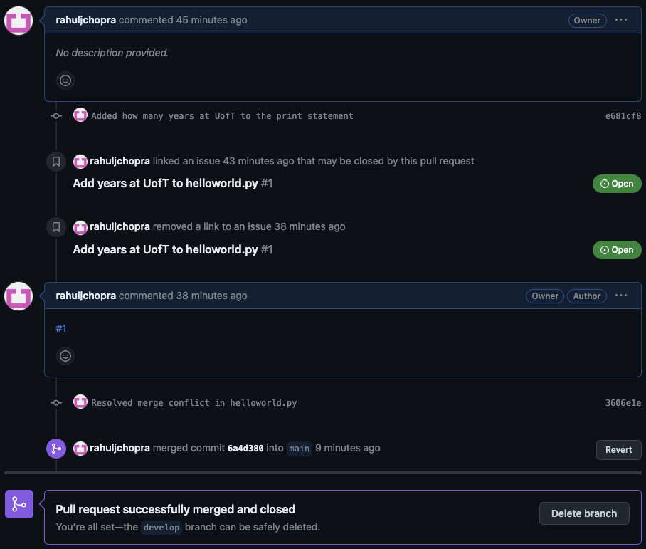
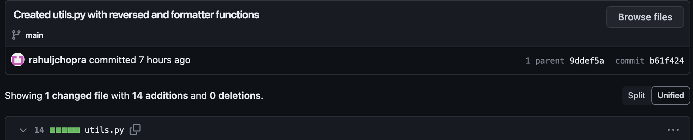
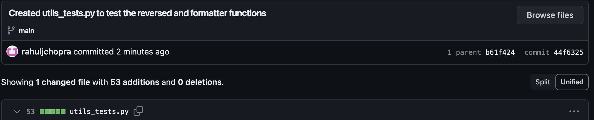

# Rahul Chopra

Activity 1: Screenshot of the commit for creating README.md file with name as the heading

Activity 2: Screenshot of the output of the merge command on the "main" branch

Activity 3: Screenshot of the successful merge

Activity 4: Screenshot of utils.py and utils_tests.py files

