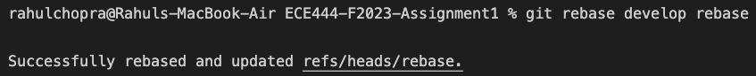
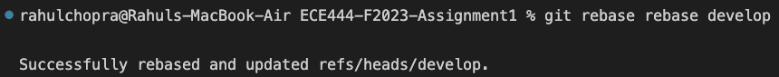

# Rahul Chopra

Activity 1: Screenshot of the commit for creating README.md file with name as the heading

Activity 2: Screenshot of the output of the merge command on the "main" branch

Activity 3: Screenshot of the successful merge

Activity 4: Screenshot of utils.py and utils_tests.py files

Activity 5: Screenshot of rebase "develop" branch on "rebase" branch

Screenshot of rebase "rebase" branch on "develop" branch

Screenshot of commits c3 -> c4 -> c1 -> c2 on "develop" branch
